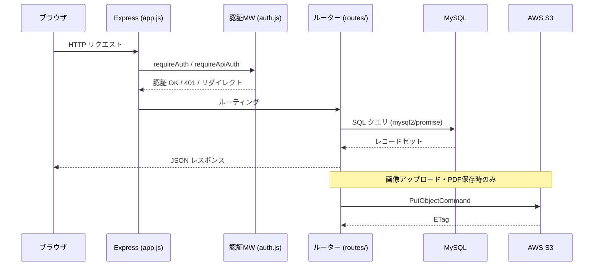

# システム概要書

**システム名**: 美容室在庫管理システム（art-the-line-app）  
**バージョン**: 1.0.0  
**作成日**: 2026-05-25  
**対象読者**: プロジェクト関係者全般（経営者・運用担当者・開発者）

---

## 1. システムの目的・背景

### 1.1 背景

美容室 Art The Line では、施術で使用するシャンプー・トリートメント・スタイリング剤などの消耗品を複数の仕入先から定期的に発注している。  
従来は手書きや表計算ソフトによる在庫管理と口頭・電話による発注を行っており、以下の課題が生じていた。

- 在庫数の把握が担当者頼りになりリアルタイム性に欠ける
- 発注書の作成・保管に手間がかかる
- 発注履歴の検索・再確認が困難

### 1.2 目的

本システムは、美容室スタッフが日常業務の中でスムーズに在庫確認・発注操作を行えるよう設計された **Web ブラウザベースの在庫管理システム** である。  
主な目的は以下のとおり。

1. 商品ごとの在庫数をリアルタイムで一元管理する
2. 発注操作をカートUI で直感的に行い、PDF発注書を自動生成する
3. 発注書（PDF）を AWS S3 に保存し、過去履歴をいつでも参照できるようにする
4. 商品マスタ・カテゴリ・仕入先会社のメンテナンスを管理者が行えるようにする

---

## 2. 対象ユーザー

| ユーザー種別 | 説明 | 主な操作 |
|-------------|------|---------|
| サロンスタッフ | 日常的な在庫確認・発注操作を担当 | 発注画面での商品選択、カート操作、発注実行 |
| 管理者（サロンオーナー等） | マスタ管理・履歴確認を担当 | 商品/カテゴリ/会社の登録・編集・削除、発注履歴確認 |

> 現在の実装では、ロール（role）フィールドはDBに存在するが画面上のアクセス制御には使用されていない。すべてのログインユーザーが全機能を利用できる。

---

## 3. 主要機能一覧

| 機能カテゴリ | 機能名 | 説明 |
|-------------|-------|------|
| 認証 | ログイン / ログアウト | ID・パスワードによる認証。セッション管理 |
| 発注 | 商品発注 | カテゴリ絞り込み、商品一覧から数量入力 |
| 発注 | カート確認・発注確定 | カート内商品の確認、発注実行（DB登録 + PDF生成）|
| 発注 | 発注書PDF生成 | A4縦 PDF を自動生成（日本語フォント対応）、S3 に保存 |
| 発注 | 発注履歴閲覧 | 過去の発注一覧（日時・発注数・PDFリンク） |
| 在庫管理 | 在庫数確認 | 商品一覧で在庫数を確認 |
| 在庫管理 | 在庫数更新 | 商品登録・編集時に在庫数を直接設定 |
| マスタ管理 | 商品管理 | 商品の登録・編集・削除（画像含む） |
| マスタ管理 | カテゴリ管理 | カテゴリの登録・編集・削除・表示順管理 |
| マスタ管理 | 仕入先会社管理 | 会社の登録・編集・削除・表示順管理 |

---

## 4. 技術スタック概要

| 区分 | 技術・ライブラリ | バージョン | 用途 |
|-----|----------------|-----------|------|
| サーバーサイド | Node.js + Express.js | 5.x | HTTP サーバー・API |
| データベース | MySQL | 8.0 | データ永続化 |
| DB クライアント | mysql2/promise | 3.x | 接続プール・生SQL実行 |
| 認証 | express-session | 1.x | セッション管理 |
| 画像/PDF ストレージ | AWS S3 (@aws-sdk/client-s3) | 3.x | 商品画像・発注書PDFのアップロード |
| PDF 生成 | PDFKit | 0.17.x | サーバーサイドでのA4 PDF生成 |
| フロントエンド | HTML / Vanilla JS / jQuery | 3.7.1 | 画面制御・DOM操作 |
| CSS フレームワーク | Bootstrap Icons (CDN) | 1.10.5 | アイコン表示 |
| 環境変数管理 | dotenv | 16.x | .env ファイル読み込み |
| コンテナ | Docker Compose | - | MySQL ローカル環境 |
| 開発ツール | nodemon | 3.x | ホットリロード |

---

## 5. システム構成図

### 5.1 通信フロー概略

---

## 6. 開発・運用環境

| 項目 | 内容 |
|-----|------|
| ローカル開発 | `npm run dev` (nodemon) + Docker Compose で MySQL 起動 |
| 起動ポート | 3000 |
| DB 接続 | `.env` の `DB_HOST`, `DB_PORT`, `DB_USER`, `DB_PASSWORD`, `DB_NAME` |
| S3 接続 | `.env` の `AWS_REGION`, `AWS_ACCESS_KEY_ID`, `AWS_SECRET_ACCESS_KEY`, `S3_BUCKET`, `S3_BASE_URL`, `S3_IMG`, `S3_PDF` |
| S3 未設定時 | 画像は `public/img/test/` に、PDFは `public/pdf/` にローカル保存 |
