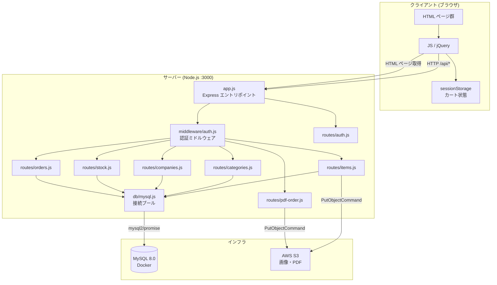
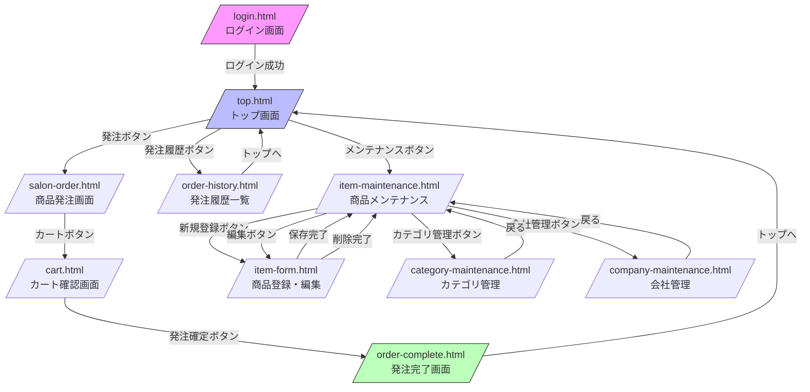
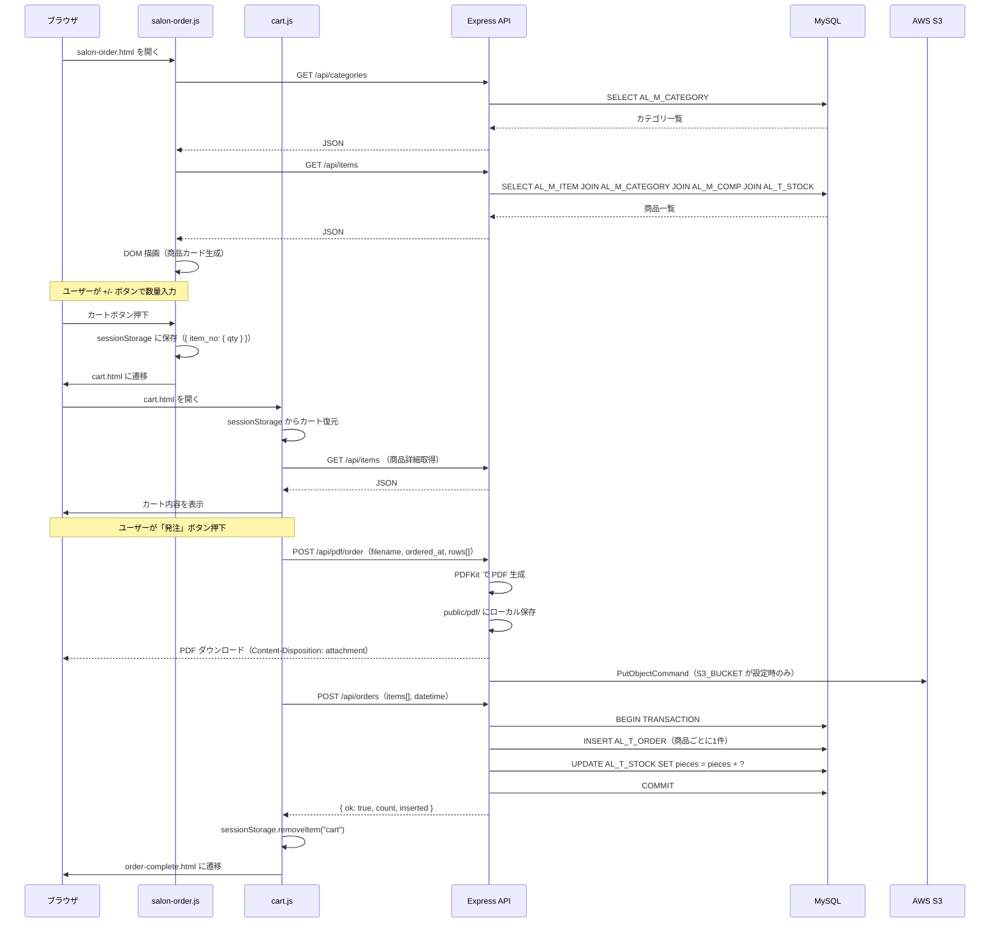
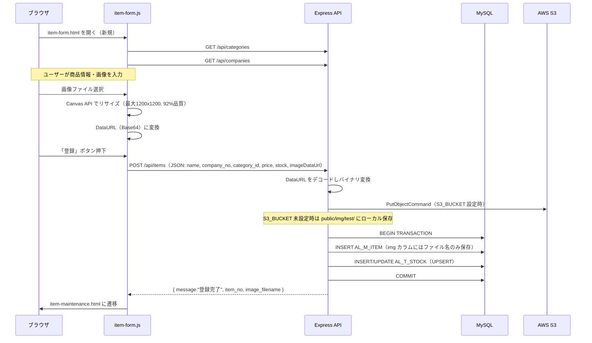

# 基本設計書

**システム名**: 美容室在庫管理システム（art-the-line-app）  
**作成日**: 2026-05-25  
**対象読者**: 開発者・アーキテクト・上流設計担当者

---

## 1. 全体アーキテクチャ

### 1.1 アーキテクチャ概要

本システムは **MPA（Multi-Page Application）** 構成を採用している。  
SPA フレームワーク（React / Vue 等）は使用せず、Express.js がHTMLファイルを静的配信し、ページごとに jQuery + Vanilla JS でAPIを呼び出してDOM を更新する。



### 1.2 レイヤー構成

| レイヤー | 役割 | 対応ファイル |
|---------|------|------------|
| プレゼンテーション | HTML 画面・UI 制御 | `public/*.html`, `public/js/*.js`, `public/css/*.css` |
| ルーティング | URL → ハンドラへの振り分け | `app.js`（静的HTML）, `routes/*.js`（API） |
| 認証 | セッション確認・リダイレクト | `middleware/auth.js` |
| ビジネスロジック | データ操作・画像処理・PDF生成 | `routes/*.js`（各ルーター内に実装） |
| データアクセス | DB 接続プール | `db/mysql.js` |
| 永続化 | データ保存 | MySQL（テーブル）、AWS S3（ファイル） |

---

## 2. 画面遷移フロー



### 2.1 認証による画面保護

- `login.html` のみ認証不要でアクセス可能
- その他全 HTML ページ（top.html 含む）は `requireAuth` ミドルウェアで保護
- 未認証アクセス時は `/login.html` にリダイレクト
- クライアント側でも `auth-check.js` が `/api/auth/check` を呼び出して二重チェック

---

## 3. モジュール構成

### 3.1 フォルダ・ファイル構成の意味

```
art-the-line-app/
├── app.js                    # エントリポイント
│                               Express 設定・セッション設定・ルーティング定義
│                               静的ファイル配信（認証制御込み）
│
├── db/
│   └── mysql.js              # MySQL 接続プール（connectionLimit: 10）
│                               全ルートが pool オブジェクトをインポートして共有
│
├── middleware/
│   └── auth.js               # 認証ミドルウェア
│                               requireAuth: HTML→未認証時は /login.html にリダイレクト
│                               requireApiAuth: API→未認証時は 401 JSON を返す
│
├── routes/                   # APIルーター群（各ファイルが1つの resource に対応）
│   ├── auth.js               # POST /login, POST /logout, GET /check
│   ├── items.js              # 商品CRUD + 画像S3アップロード
│   ├── categories.js         # カテゴリCRUD
│   ├── companies.js          # 会社CRUD
│   ├── stock.js              # 在庫参照・在庫加算
│   ├── orders.js             # 発注登録・発注履歴
│   └── pdf-order.js          # 発注書PDF生成・S3アップロード
│
├── public/                   # 静的ファイル（ブラウザへ直接配信）
│   ├── *.html                # 各画面の HTML
│   ├── js/                   # 各画面の JavaScript
│   │   ├── load-header.js    # 全画面共通：ヘッダー動的読み込み・ローディングOL・ログアウト
│   │   └── auth-check.js     # 全画面共通：クライアント側認証チェック
│   ├── css/                  # 各画面の CSS（common.css + ページ別CSS）
│   ├── img/                  # 静的画像（ロゴ、テスト用商品画像）
│   └── pdf/                  # 生成済み発注PDF（S3未設定時のローカル保存先）
│
└── fonts/
    └── NotoSansJP-*.ttf      # PDF生成に使用する日本語フォント
```

### 3.2 フロントエンド JS の責務分担

| ファイル | 責務 |
|---------|------|
| `load-header.js` | 全画面：ヘッダーHTML の動的挿入、fetch のローディングオーバーレイフック、ログアウトボタン処理 |
| `auth-check.js` | 全画面：`/api/auth/check` を呼び出し、未認証時は login.html へリダイレクト |
| `top.js` | トップ：各画面への遷移ボタン処理 |
| `salon-order.js` | 発注画面：カテゴリ取得・商品一覧描画・+/-ボタン操作・sessionStorage 保存・カートへ遷移 |
| `cart.js` | カート画面：sessionStorage からカート復元・発注実行（PDF生成→DB登録）→完了画面遷移 |
| `order-complete.js` | 発注完了：PDF ダウンロードリンク表示・sessionStorage クリア |
| `order-history.js` | 発注履歴：発注履歴一覧の取得・表示 |
| `item-maintenance.js` | 商品メンテ：商品一覧取得・キーワード検索・登録/編集/削除ボタン制御 |
| `item-form.js` | 商品フォーム：Canvas API 画像リサイズ・DataURL変換・API 送信（新規/更新/削除） |
| `company-maintenance.js` | 会社管理：インライン編集・登録・削除 |
| `category-maintenance.js` | カテゴリ管理：インライン編集・登録・削除 |

---

## 4. API 一覧

### 4.1 認証 API（認証不要）

| メソッド | パス | 概要 | リクエスト | レスポンス |
|---------|------|------|-----------|-----------|
| POST | /api/auth/login | ログイン | `{ username, password }` | `{ success, message }` |
| POST | /api/auth/logout | ログアウト | - | `{ success, message }` |
| GET | /api/auth/check | 認証確認 | - | `{ authenticated, user? }` |

### 4.2 商品 API（要認証）

| メソッド | パス | 概要 | 備考 |
|---------|------|------|------|
| GET | /api/items | 商品一覧（発注用） | カテゴリ名・会社名・在庫数を JOIN |
| GET | /api/items/maintenance | 商品一覧（メンテ用） | `?keyword=` で商品名絞込 |
| GET | /api/items/:item_no | 商品1件取得 | 在庫数を LEFT JOIN |
| POST | /api/items | 商品新規登録 | DataURL 画像 → S3 / ローカル。在庫も同時登録 |
| PUT | /api/items/:item_no | 商品更新 | 未送信フィールドは COALESCE で現状維持 |
| DELETE | /api/items/:item_no | 商品削除 | 論理削除（delete_flag='1'） |

### 4.3 カテゴリ API（要認証）

| メソッド | パス | 概要 |
|---------|------|------|
| GET | /api/categories | カテゴリ一覧（`?keyword=` 絞込可） |
| POST | /api/categories | カテゴリ新規登録 |
| PUT | /api/categories/:category_no | カテゴリ更新 |
| DELETE | /api/categories/:category_no | カテゴリ削除（論理削除） |

### 4.4 会社 API（要認証）

| メソッド | パス | 概要 |
|---------|------|------|
| GET | /api/companies | 会社一覧（`?keyword=` 絞込可） |
| POST | /api/companies | 会社新規登録 |
| PUT | /api/companies/:comp_no | 会社更新 |
| DELETE | /api/companies/:comp_no | 会社削除（論理削除） |

### 4.5 在庫 API（要認証）

| メソッド | パス | 概要 |
|---------|------|------|
| GET | /api/stocks | 在庫一覧（item_no + pieces） |
| POST | /api/stocks/add | 在庫加算（items 配列で複数件一括） |

### 4.6 発注 API（要認証）

| メソッド | パス | 概要 |
|---------|------|------|
| POST | /api/orders | 発注登録（AL_T_ORDER INSERT + AL_T_STOCK pieces 加算、DBトランザクション） |
| GET | /api/orders/history | 発注履歴取得（order_date で GROUP BY、直近100件、PDF リンク付き） |

### 4.7 PDF API（要認証）

| メソッド | パス | 概要 |
|---------|------|------|
| POST | /api/pdf/order | 発注書 PDF 生成（A4・日本語フォント） → ローカル保存 → S3 アップロード → クライアントへダウンロード |

### 4.8 設定 API（認証不要）

| メソッド | パス | 概要 |
|---------|------|------|
| GET | /api/config | フロント用 S3 設定情報（S3_BASE_URL, S3_PDF）を返す |

---

## 5. データフロー（主要ユースケース別）

### 5.1 発注フロー



### 5.2 商品登録フロー



---

## 6. 外部サービス連携

### 6.1 AWS S3

| 項目 | 内容 |
|-----|------|
| 用途 | 商品画像のホスティング、発注書PDF のアーカイブ |
| SDK | @aws-sdk/client-s3 v3 |
| 操作 | PutObjectCommand（アップロードのみ。取得は URL 直接アクセス） |
| 認証方式 | AWS SDK デフォルト認証チェーン（環境変数 `AWS_ACCESS_KEY_ID` / `AWS_SECRET_ACCESS_KEY` または IAM ロール）|
| バケット名 | 環境変数 `S3_BUCKET` で指定（例: `art-the-line`） |
| 画像パス | `S3_IMG` プレフィックス + ファイル名（例: `order-list/images/1234567890_abc.jpg`） |
| PDF パス | `S3_PDF` プレフィックス + ファイル名（例: `order-list/pdfs/ArtTheLine_在庫発注_20260525120000.pdf`） |
| フォールバック | `S3_BUCKET` 未設定時はローカル保存（画像: `public/img/test/`、PDF: `public/pdf/`） |

### 6.2 フロントエンドへの S3 URL 公開方法

- `/api/config` エンドポイントが `S3_BASE_URL` と `S3_PDF` をフロントに返す
- フロント JS はレスポンスの `image_url` フィールド（サーバー側で `S3_BASE_URL + S3_IMG + encodeURIComponent(filename)` として組み立て済み）を使用

---

## 7. 非機能要件

### 7.1 パフォーマンス

| 項目 | 現状・設定値 |
|-----|------------|
| DB 接続プール | connectionLimit: 10（`db/mysql.js`） |
| リクエストボディ上限 | 10 MB（`express.json({ limit: "10mb" })`）。Base64 画像を含む JSON を受け取るため |
| 画像リサイズ | クライアント側で Canvas API を使い最大 1200x1200 / 92%品質に圧縮してから送信 |
| ファイル上限チェック | `item-form.js` でアップロード前に 5MB 上限チェック |

### 7.2 セキュリティ（現状と課題）

| 項目 | 現状 | リスク | 推奨対応 |
|-----|------|-------|---------|
| パスワード保存 | 平文でDBに保存 | 高：DB 漏洩時に即座に認証情報が流出 | bcrypt でハッシュ化（package.json に bcrypt 含むが未使用） |
| パスワード比較 | 平文文字列比較 | 高：タイミング攻撃にも脆弱 | `bcrypt.compare()` を使用 |
| セッションストア | メモリストア（デフォルト） | 中：サーバー再起動でセッション消失。スケールアウト不可 | Redis 等の外部セッションストアを導入 |
| Cookie secure | false に固定 | 中：HTTP でも Cookie が送信されてしまう | 本番環境では `secure: true` に設定（HTTPS 必須） |
| ロール制御 | role カラムあり・未実装 | 中：全ログインユーザーが全機能を操作可能 | role に基づいたアクセス制御ミドルウェアを実装 |
| SQL インジェクション | プリペアドステートメント使用 | 低：対策済み | 現状維持 |
| XSS | 各 JS に `escapeHtml()` 実装 | 低：基本的な対策あり。ただし関数が重複実装 | 共通ユーティリティとして一元化 |

### 7.3 可用性・信頼性

| 項目 | 現状 |
|-----|------|
| セッション永続性 | メモリストアのため再起動でセッション消失 |
| DB トランザクション | 発注登録（AL_T_ORDER + AL_T_STOCK 同時更新）はトランザクション保護済み |
| PDF 生成とDB登録の一貫性 | PDF 生成（`/api/pdf/order`）と発注DB登録（`/api/orders`）は別API呼び出しのため、一方の失敗時に不整合が発生し得る（設計上の課題） |
| データバックアップ | Docker ボリューム（`mysql-data/`）にデータが存在。定期バックアップは未実装 |

### 7.4 保守性

| 項目 | 現状 |
|-----|------|
| テスト | 自動テスト未実装（`package.json` の `test` スクリプトがプレースホルダ） |
| ロギング | `console.error()` / `console.log()` のみ。構造化ログ・外部ログ収集未実装 |
| エラーハンドリング | 各ルーターで try-catch し、500 JSON レスポンスを返す実装 |
