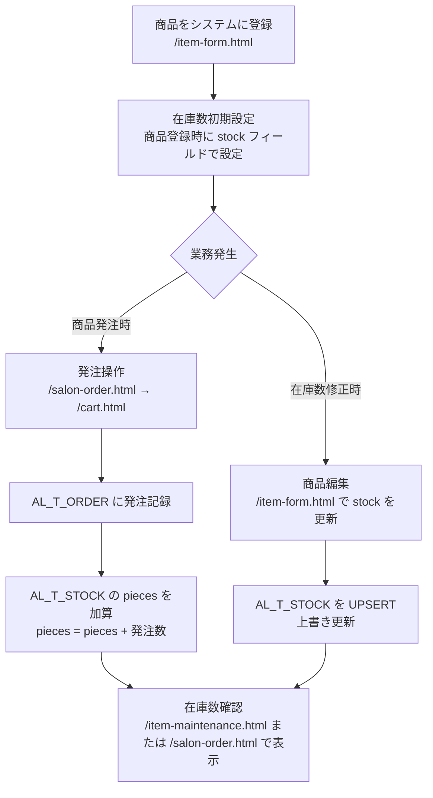
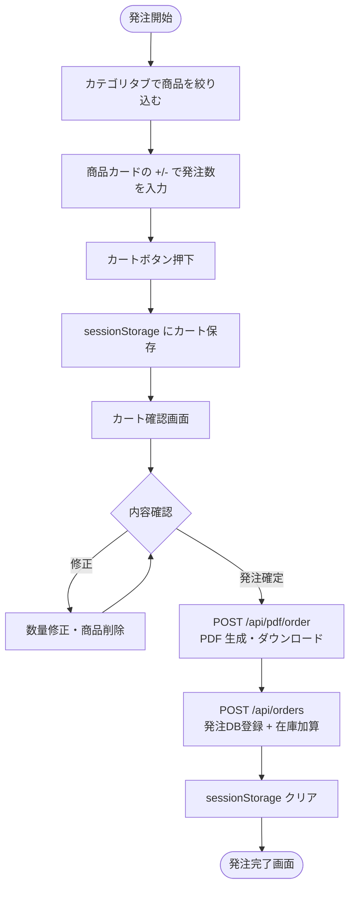
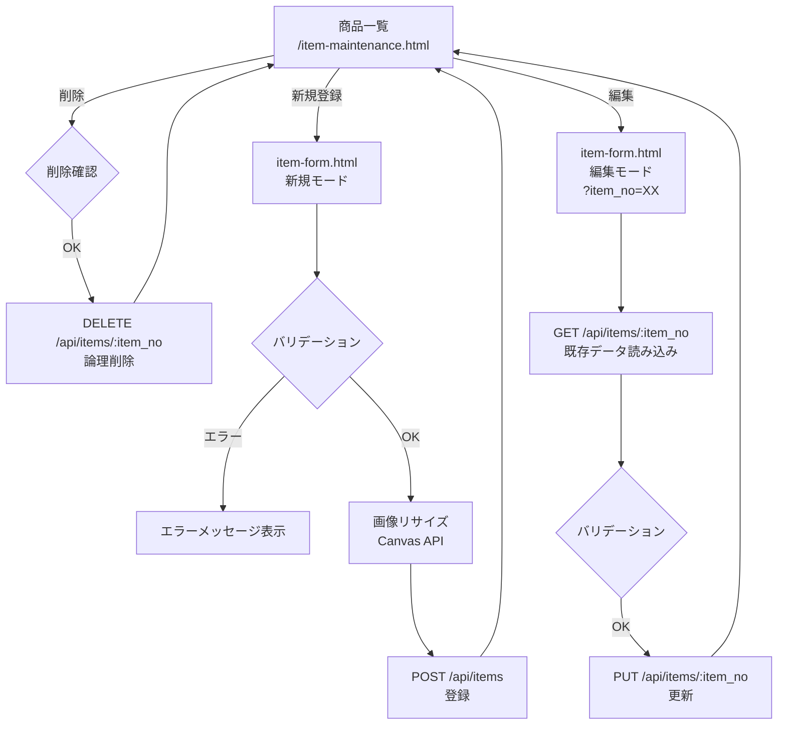

# 詳細設計書

**システム名**: 美容室在庫管理システム（art-the-line-app）  
**作成日**: 2026-05-25  
**対象読者**: 実装担当者・保守担当者

---

## 1. 画面別機能仕様

### 1.1 ログイン画面（/login.html）

**概要**: システムへの入口となる認証画面。

| 項目 | 内容 |
|-----|------|
| アクセス制御 | 認証不要 |
| 担当 JS | ページ固有 JS（inline） |
| API | POST /api/auth/login |

**フォーム定義**

| フィールド名 | 入力タイプ | 必須 | バリデーション |
|------------|-----------|------|---------------|
| username | text | ○ | 空文字不可（サーバー側でチェック） |
| password | password | ○ | 空文字不可（サーバー側でチェック） |

**処理フロー**
1. フォーム送信 → `POST /api/auth/login` にリクエスト
2. 成功（200）→ `/top.html` に遷移
3. 失敗（401）→ エラーメッセージを画面に表示（alert または DOM への挿入）
4. サーバーエラー（400/500）→ エラーメッセージ表示

---

### 1.2 トップ画面（/top.html）

**概要**: ログイン後のメインメニュー。各機能へのナビゲーションハブ。

| 項目 | 内容 |
|-----|------|
| アクセス制御 | requireAuth（未認証時 → /login.html へリダイレクト） |
| 担当 JS | top.js, load-header.js, auth-check.js |

**機能一覧**

| ボタン | 遷移先 |
|-------|-------|
| 発注する | /salon-order.html |
| 発注履歴 | /order-history.html |
| 商品メンテナンス | /item-maintenance.html |

---

### 1.3 商品発注画面（/salon-order.html）

**概要**: 発注する商品と数量を選択するカート入力画面。

| 項目 | 内容 |
|-----|------|
| アクセス制御 | requireAuth |
| 担当 JS | salon-order.js, load-header.js, auth-check.js |
| 使用 API | GET /api/categories, GET /api/items |
| 状態管理 | sessionStorage キー: `cart`、`activeCategory` |

**機能一覧**

| 機能 | 説明 |
|-----|------|
| カテゴリタブ | 「全て」含むカテゴリボタンを動的生成（GET /api/categories）。クリックで商品を絞り込み |
| 商品カード一覧 | 商品画像・名前・カテゴリバッジを表示（GET /api/items） |
| 数量入力 | +/- ボタンで 0〜99 の範囲で数量を変更 |
| カートバッジ | 全商品の数量合計をヘッダーのバッジに表示 |
| カートボタン | sessionStorage に `{ item_no: { qty } }` 形式で保存 → /cart.html に遷移 |
| セッション復元 | ページ再表示時に sessionStorage からカート状態を復元 |
| 3列レイアウト調整 | 商品数が3の倍数でない場合、プレースホルダ div を追加 |

**データ構造（sessionStorage: cart）**
```json
{
  "1": { "qty": 2 },
  "5": { "qty": 1 }
}
```
キーは `item_no`（文字列）、値は `{ qty: number }`。

---

### 1.4 カート確認・発注確定画面（/cart.html）

**概要**: カート内容の確認・修正と発注確定を行う画面。

| 項目 | 内容 |
|-----|------|
| アクセス制御 | requireAuth |
| 担当 JS | cart.js, load-header.js, auth-check.js |
| 使用 API | GET /api/items, POST /api/pdf/order, POST /api/orders |

**機能一覧**

| 機能 | 説明 |
|-----|------|
| カート一覧表示 | sessionStorage のカートと GET /api/items の結果をマージして表示 |
| 数量修正 | カート内で数量を変更 |
| 商品削除 | 個別商品をカートから削除 |
| 発注確定ボタン | 以下の処理を順次実行（詳細は処理フローを参照） |

**発注確定の処理フロー**
```
1. POST /api/pdf/order
   リクエスト: { filename, ordered_at, rows: [{ name, qty, comp_name }] }
   → PDF ダウンロード開始（Content-Disposition: attachment）
   → サーバー側で S3 にもアップロード

2. POST /api/orders
   リクエスト: { items: [{ item_no, pieces }], datetime: "YYYYMMDDHHmmss" }
   → AL_T_ORDER に商品数分レコード INSERT
   → AL_T_STOCK で pieces 加算（DBトランザクション）

3. sessionStorage.removeItem("cart")
4. location.href = "order-complete.html"
```

**注意点**: PDF 生成（手順1）と DB 登録（手順2）が別 API のため、一方が失敗した場合に不整合が発生し得る。

---

### 1.5 発注完了画面（/order-complete.html）

**概要**: 発注完了のフィードバックと PDF ダウンロードリンクを表示する画面。

| 項目 | 内容 |
|-----|------|
| アクセス制御 | requireAuth |
| 担当 JS | order-complete.js, load-header.js, auth-check.js |

**機能一覧**

| 機能 | 説明 |
|-----|------|
| 完了メッセージ | 発注完了を通知 |
| PDF ダウンロードリンク | 生成済み PDF へのリンクを表示 |
| トップへ戻るボタン | /top.html に遷移 |

---

### 1.6 発注履歴一覧画面（/order-history.html）

**概要**: 過去の発注履歴を一覧表示し、PDF を参照できる画面。

| 項目 | 内容 |
|-----|------|
| アクセス制御 | requireAuth |
| 担当 JS | order-history.js, load-header.js, auth-check.js |
| 使用 API | GET /api/orders/history |

**表示項目**

| 項目 | 説明 |
|-----|------|
| 発注日時（JST） | order_date_jst（UTC+9 変換済み） |
| 発注点数 | order_pieces（total_pieces） |
| 発注者 | create_user_cd |
| 発注書PDF | PDF リンク（S3 または ローカル） |

---

### 1.7 商品メンテナンス画面（/item-maintenance.html）

**概要**: 商品の一覧確認・検索・新規登録・編集・削除を行う管理画面。

| 項目 | 内容 |
|-----|------|
| アクセス制御 | requireAuth |
| 担当 JS | item-maintenance.js, load-header.js, auth-check.js |
| 使用 API | GET /api/items/maintenance, DELETE /api/items/:item_no |

**機能一覧**

| 機能 | 説明 |
|-----|------|
| 商品一覧グリッド | 商品番号・名前・カテゴリ・会社・金額・在庫数を表示 |
| キーワード検索 | 商品名で部分一致検索（`?keyword=` クエリパラメータ）|
| 新規登録ボタン | /item-form.html（新規モード）に遷移 |
| 編集ボタン | /item-form.html（編集モード）に item_no を渡して遷移 |
| 削除ボタン | 確認ダイアログ後に DELETE /api/items/:item_no で論理削除 |
| カテゴリ管理ボタン | /category-maintenance.html に遷移 |
| 会社管理ボタン | /company-maintenance.html に遷移 |

---

### 1.8 商品登録・編集フォーム（/item-form.html）

**概要**: 商品の新規登録・更新・削除を行うフォーム画面。クエリパラメータ `item_no` の有無でモードを切替。

| 項目 | 内容 |
|-----|------|
| アクセス制御 | requireAuth |
| 担当 JS | item-form.js, load-header.js, auth-check.js |
| 使用 API | GET /api/items/:item_no, GET /api/categories, GET /api/companies, POST /api/items, PUT /api/items/:item_no, DELETE /api/items/:item_no |

**フォーム定義**

| フィールド名 | 入力タイプ | 必須 | バリデーション | 備考 |
|------------|-----------|------|---------------|------|
| 商品名（name） | text | ○ | 空文字不可 | |
| 仕入先会社（company_no） | select | ○ | 選択必須 | GET /api/companies から動的生成 |
| カテゴリ（category_id） | select | ○ | 選択必須 | GET /api/categories から動的生成 |
| 金額（price） | number | - | 0以上の整数 | |
| 在庫数（stock） | number | - | 0以上の整数 | |
| キーワード（keyword） | text | - | - | 検索用 |
| 備考（note） | textarea | - | - | |
| 商品画像（imageDataUrl） | file（input[type=file]） | - | 5MB 以下、JPEG/PNG/GIF/WEBP | Canvas で 1200x1200 にリサイズ後 DataURL 変換 |

**画像処理詳細（item-form.js）**
1. `input[type=file]` で画像ファイル選択
2. ファイルサイズ確認（5MB 超過でエラーダイアログ）
3. `FileReader.readAsDataURL()` で DataURL 読み込み
4. `canvas` 要素に描画し、最大 1200x1200 に縮小（アスペクト比維持）
5. `canvas.toDataURL('image/jpeg', 0.92)` で JPEG に変換（品質 92%）
6. DataURL を JSON フィールド `imageDataUrl` としてサーバーに送信

**モード判定**
```javascript
const urlParams = new URLSearchParams(location.search);
const itemNo = urlParams.get('item_no'); // null = 新規, 数値 = 編集
```

---

### 1.9 カテゴリ管理画面（/category-maintenance.html）

**概要**: カテゴリのインライン編集・新規登録・削除を行う管理画面。

| 項目 | 内容 |
|-----|------|
| アクセス制御 | requireAuth |
| 担当 JS | category-maintenance.js, load-header.js, auth-check.js |
| 使用 API | GET /api/categories, POST /api/categories, PUT /api/categories/:category_no, DELETE /api/categories/:category_no |

**機能一覧**

| 機能 | 説明 |
|-----|------|
| カテゴリ一覧テーブル | カテゴリNo・名前・表示順・備考を表示 |
| インライン編集 | 行をクリックして直接編集、保存ボタンで PUT API 呼出 |
| 新規登録フォーム | 画面下部のフォームから POST API で新規登録 |
| 削除 | 各行の削除ボタンで論理削除（DELETE API） |

---

### 1.10 会社管理画面（/company-maintenance.html）

カテゴリ管理画面と同一の構造・機能を持つ。対象テーブルが AL_M_COMP で API パスが `/api/companies` となる点のみ異なる。

---

## 2. API エンドポイント詳細

### 2.1 POST /api/auth/login

**処理ロジック**
```
1. req.body から username, password を取得
2. 入力値バリデーション（どちらかが空 → 400）
3. AL_M_USER テーブルを login_id = username AND delete_flag = '0' で SELECT
4. 取得行が 0 件 → 401（ユーザーが存在しない）
5. user.password !== password で平文比較 → 不一致は 401
6. req.session.user に { userId, loginId, userName, role, loginTime, isAuthenticated: true } を格納
7. 200 + { success: true } を返す
```

**リクエスト**
```json
{ "username": "admin", "password": "pass1234" }
```

**レスポンス（成功）**
```json
{ "success": true, "message": "ログインしました" }
```

**レスポンス（失敗）**
```json
{ "success": false, "message": "ユーザー名またはパスワードが不正です" }
```

---

### 2.2 POST /api/items（商品新規登録）

**リクエスト Body**
```json
{
  "name": "シャンプー A",
  "company_no": 1,
  "category_id": 2,
  "price": 1500,
  "stock": 10,
  "keyword": "シャンプー 頭皮",
  "note": "業務用",
  "imageDataUrl": "data:image/jpeg;base64,/9j/..."
}
```

**処理ロジック**
```
1. name, company_no, category_id の必須チェック（どれかが falsy → 400）
2. imageDataUrl が "data:" で始まる場合:
   a. Base64 デコード
   b. S3_BUCKET が設定済み → S3 PutObjectCommand でアップロード
   c. S3_BUCKET 未設定 → public/img/test/ にローカル保存
   d. ファイル名: `${Date.now()}_${random}.${ext}` 形式
3. DB トランザクション開始
4. AL_M_ITEM に INSERT（img にはファイル名のみ保存）
5. stock が指定されていれば AL_T_STOCK に UPSERT
6. COMMIT
7. 201 + { message, item_no, image_filename } を返す
```

**レスポンス（成功）**
```json
{ "message": "登録完了", "item_no": 42, "image_filename": "1716858000000_abc123.jpg" }
```

---

### 2.3 POST /api/orders（発注登録）

**リクエスト Body**
```json
{
  "items": [
    { "item_no": 1, "pieces": 3 },
    { "item_no": 5, "pieces": 1 }
  ],
  "datetime": "20260525120000"
}
```

**処理ロジック**
```
1. items, datetime を取得
2. DB 接続取得 → BEGIN TRANSACTION
3. items を for ループで1件ずつ処理:
   a. AL_T_ORDER に INSERT（order_date は datetime を UTC 変換して保存）
   b. AL_T_STOCK で pieces = pieces + ? で加算 UPDATE
4. COMMIT
5. { ok: true, count, inserted } を返す
6. 例外発生時は ROLLBACK → 500
```

---

### 2.4 POST /api/pdf/order（発注書 PDF 生成）

**リクエスト Body**
```json
{
  "filename": "ArtTheLine_在庫発注_20260525120000.pdf",
  "ordered_at": "2026/05/25 12:00:00",
  "rows": [
    { "name": "シャンプー A", "qty": 3, "comp_name": "株式会社XYZ" },
    { "name": "トリートメント B", "qty": 1, "comp_name": "ABC商事" }
  ]
}
```

**処理ロジック**
```
1. rows の空チェック（空 → 400）
2. PDFDocument（A4, margin: 50）を作成
3. NotoSansJP フォントを登録
4. Content-Disposition: attachment ヘッダーを設定
5. public/pdf/ に書き込みストリームを作成
6. doc.pipe(fileStream) と doc.pipe(res) で同時出力
7. PDF レイアウト:
   - タイトル: "在庫発注書"（fontSize: 14）
   - 発注日: ordered_at（fontSize: 10）
   - テーブルヘッダー: 商品名（45%）/ 個数（10%）/ 発注先（40%）
   - テーブル行: rows をループして drawRow() で描画
   - ページをまたぐ場合は addPage() して再度ヘッダーを描画
8. doc.end()
9. fileStream の finish イベントで S3_BUCKET が設定済みの場合:
   a. ローカルファイルを読み込み S3 PutObjectCommand でアップロード
   b. ローカルファイルを削除（fs.unlinkSync）
```

---

## 3. 業務フロー

### 3.1 在庫管理フロー



**注意**: 在庫の増減履歴テーブルが存在しないため、手動更新による在庫変動は追跡不可。発注による増加のみ AL_T_ORDER で履歴参照が可能。

### 3.2 発注フロー



### 3.3 マスタ管理フロー（商品）



---

## 4. エラーハンドリング方針

### 4.1 サーバーサイド

| 状況 | HTTPステータス | レスポンス形式 |
|-----|--------------|--------------|
| 入力値不正 | 400 | `{ error: "エラーメッセージ" }` または `{ success: false, message: "..." }` |
| 未認証 | 401 | `{ success: false, message: "認証が必要です。ログインしてください" }` |
| 対象リソース不在 | 404 | `{ error: "対象の商品が見つかりません" }` など |
| DB エラー / 内部エラー | 500 | `{ error: "エラーメッセージ" }` |

すべてのルーターで `try-catch` による例外処理を実装。catch ブロックでは `console.error()` でログ出力後に 500 JSON を返す。

### 4.2 クライアントサイド

| 状況 | 処理 |
|-----|------|
| API 呼出失敗（!res.ok） | `console.error()` + `alert()` でユーザーに通知 |
| 認証エラー（401） | auth-check.js が `/login.html` にリダイレクト |
| 画像サイズ超過 | `item-form.js` で 5MB チェック後にアラート表示 |
| カートが空での発注 | `/cart.html` で確認メッセージ表示（items[] が空）|

---

## 5. セキュリティ上の課題と改善提案

### 5.1 高リスク課題

#### 課題1: パスワード平文保存・平文比較

**現状コード（routes/auth.js）**:
```javascript
if (user.password !== password) {  // 平文比較
  return res.status(401).json({ ... });
}
```

**問題点**: DB が漏洩した場合に全ユーザーのパスワードが即座に判明する。タイミング攻撃にも脆弱。

**改善案**:
```javascript
// package.json に bcrypt が含まれているため導入コストは低い
const bcrypt = require('bcrypt');
const isMatch = await bcrypt.compare(password, user.password);
if (!isMatch) { return res.status(401).json({ ... }); }

// パスワード登録時
const hashed = await bcrypt.hash(plainPassword, 10);
// AL_M_USER の password カラムに hashed を保存
```

---

### 5.2 中リスク課題

#### 課題2: セッションメモリストア

**現状**: `express-session` のデフォルトストア（メモリ）を使用。

**問題点**:
- サーバー再起動でセッションが消失し、ユーザーが強制ログアウトされる
- サーバーを複数プロセス/インスタンスに増やした場合にセッションが共有されない

**改善案**:
```javascript
// connect-redis を導入
const RedisStore = require('connect-redis')(session);
const { createClient } = require('redis');
const redisClient = createClient({ url: process.env.REDIS_URL });
app.use(session({
  store: new RedisStore({ client: redisClient }),
  // ... 他の設定
}));
```

#### 課題3: Cookie の secure フラグ

**現状コード（app.js）**:
```javascript
cookie: {
  secure: false,  // 本番環境ではtrueに設定（HTTPS必須）
  httpOnly: true,
  maxAge: 24 * 60 * 60 * 1000
}
```

**改善案**:
```javascript
cookie: {
  secure: process.env.NODE_ENV === 'production',  // 環境変数で切替
  httpOnly: true,
  maxAge: 24 * 60 * 60 * 1000
}
```

#### 課題4: ロール制御未実装

**現状**: `AL_M_USER.role` カラムはあるが、アクセス制御に使われていない。

**改善案**:
```javascript
// middleware/auth.js に追加
const requireRole = (allowedRoles) => (req, res, next) => {
  const { role } = req.session.user || {};
  if (allowedRoles.includes(role)) return next();
  return res.status(403).json({ message: '権限がありません' });
};

// app.js でのルート設定
app.use('/api/items', requireApiAuth, requireRole(['admin']), require('./routes/items'));
```

---

### 5.3 低リスク課題

#### 課題5: escapeHtml の重複実装

**現状**: `escapeHtml()` 関数が各 JS ファイル（salon-order.js, item-maintenance.js 等）に重複実装されている。

**改善案**: `public/js/utils.js` に共通関数として定義し、各 HTML から読み込む。

#### 課題6: PDF 生成とDB登録の不整合リスク

**現状**: cart.js が `POST /api/pdf/order` と `POST /api/orders` を別々に呼び出しており、一方が成功・他方が失敗した場合に不整合が発生し得る。

**改善案オプションA**: 発注確定を1つのAPIエンドポイント（`POST /api/orders/confirm`）に統合し、PDF 生成と DB 登録を同一トランザクションに近い形で処理する。  
**改善案オプションB**: PDF 生成をクライアントサイド（jsPDF 等）に移し、API は DB 登録のみとする。

---

## 6. 共通コンポーネント詳細

### 6.1 load-header.js

全画面の HTML が `<div id="header-placeholder"></div>` を持ち、このスクリプトが `header.html` をフェッチして挿入する。

**主な機能**:
1. `fetch('/header.html')` でヘッダー HTML を取得・挿入
2. `window.fetch` をオーバーライドして全 fetch リクエストの前後に `#loading-overlay` の表示/非表示を制御
3. ヘッダー内のログアウトボタンクリックで `POST /api/auth/logout` → `location.href = '/login.html'`

### 6.2 auth-check.js

全画面で読み込まれる認証チェックスクリプト。

**処理**:
```
GET /api/auth/check → { authenticated: false } の場合 → location.href = '/login.html'
```

サーバー側の `requireAuth` ミドルウェアと二重でチェックすることで、クライアント側での即時リダイレクトを実現する。
